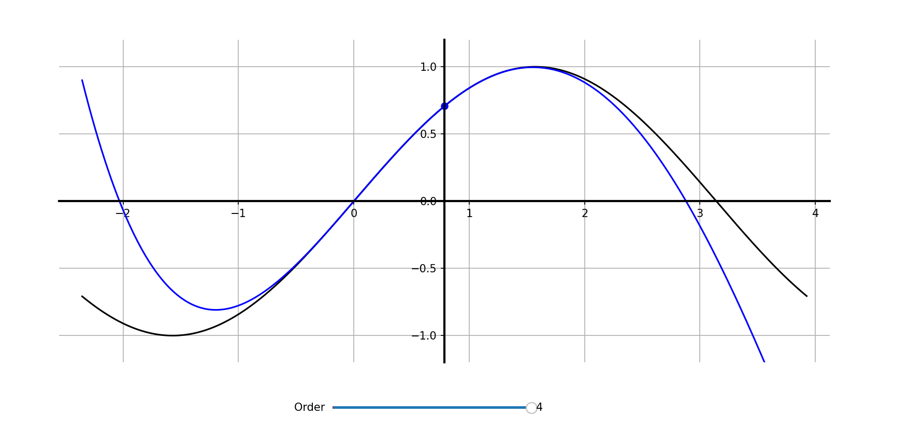

# Interactive Visualization of the Taylor Series Approximation

## Objective
- This project provides an interactive visualization of Taylor polynomial approximations for a given continuous and infinitely differentiable function using Python and Matplotlib, along with the given function itself for comparison.

## Features
- Computes numerical derivatives using finite difference methods.
- Constructs Taylor polynomials of arbitrary order.
- Interactive slider to vary approximation order in real time.
- Visual comparison between the function and its Taylor approximation.

## Requirements
- Python 3.x
- NumPy
- Matplotlib

## How to Run
1. Clone the repository.
2. Install dependencies:
   pip install numpy matplotlib
3. Run:
   python taylor_visualizer.py

## Example

## Notes
- Numerical instability limits accuracy beyond 4th–5th order.
- Currently implemented for sin(x); extensible to other smooth functions.
- Slider to vary the point around which local approximation is carried out may be added.
